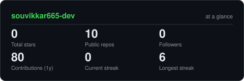
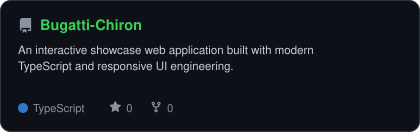
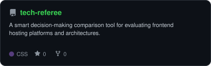
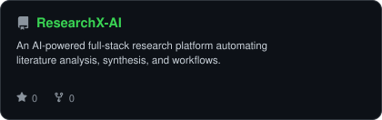
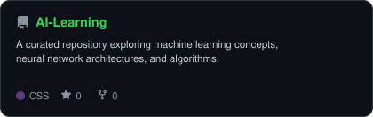

<div align="center">

<!-- PORTRAIT - generated by scripts/dotify.py from assets/profile.png.
     Colour mode, so one file serves both GitHub themes. Regenerate with:
       python scripts/dotify.py assets/profile.png -o assets/portrait \
         --cols 100 --equalize --detail 0.5 --color --reveal -->


<br>

<!-- NAME / TAGLINE - animated typing -->
<a href="https://github.com/souvikkar665-dev">
  
</a>

<br>

<!-- SOCIALS -->
<a href="https://linkedin.com/in/souvikkar665-dev"></a>
<a href="mailto:souvikkar665@gmail.com"></a>
<a href="https://github.com/souvikkar665-dev"></a>
<a href="https://codeforces.com/profile/souvikkar665"></a>
<a href="https://leetcode.com/u/souvikkar665"></a>


</div>

---

## `~/` whoami

```console
$ cat about.txt
```

Hi, I'm **Souvik Kar**. I'm a BTech CSE (AI & ML) student focused on developing intelligent, real-world solutions that go beyond just theory.

- Currently building **[ResearchX-AI](https://github.com/souvikkar665-dev/ResearchX-AI)** and **[Bugatti-Chiron](https://github.com/souvikkar665-dev/Bugatti-Chiron)**
- Exploring **Machine Learning, Deep Learning & Web Systems**
- Fun fact: **I love diving into the intersection of AI models and scalable frontend architecture.**

<br>

<div align="center">

## `~/` toolbox


</div>

---

<div align="center">

## `~/` skill radar

<table>
<tr>
<td width="50%" align="center" valign="middle">

<!-- Self-rated radar - edit assets/skills.json, the workflow redraws it -->
<picture>
  <source media="(prefers-color-scheme: dark)"  srcset="assets/radar-dark.svg">
  <source media="(prefers-color-scheme: light)" srcset="assets/radar-light.svg">
  
</picture>

</td>
<td width="50%" align="center" valign="middle">

<!-- Live radar built from real language byte counts across your repos -->
<picture>
  <source media="(prefers-color-scheme: dark)"  srcset="assets/radar-langs-dark.svg">
  <source media="(prefers-color-scheme: light)" srcset="assets/radar-langs-light.svg">
  
</picture>

</td>
</tr>
</table>

</div>

---

<div align="center">

## `~/` contribution calendar

<!-- 3D isometric calendar, regenerated every 6h by .github/workflows/metrics.yml -->


<br><br>

<!-- Snake eats the contribution graph - .github/workflows/snake.yml -->
<picture>
  <source media="(prefers-color-scheme: dark)"  srcset="https://raw.githubusercontent.com/souvikkar665-dev/souvikkar665-dev/output/snake-dark.svg">
  <source media="(prefers-color-scheme: light)" srcset="https://raw.githubusercontent.com/souvikkar665-dev/souvikkar665-dev/output/snake.svg">
  
</picture>

</div>

---

<div align="center">

## `~/` the numbers

<!-- Generated by scripts/cards.py into this repo. Deliberately NOT
     github-readme-stats / streak-stats / github-profile-trophy: those are
     shared public instances that go down and take the whole section with them. -->
<picture>
  <source media="(prefers-color-scheme: dark)"  srcset="assets/card-stats-dark.svg">
  <source media="(prefers-color-scheme: light)" srcset="assets/card-stats-light.svg">
  
</picture>

<br>


<br><br>


</div>

---

<div align="center">

## `~/` selected work

<!-- Cards generated by scripts/cards.py from assets/projects.json.
     Stars, forks and language are pulled live from the API on every run. -->
<table>
<tr>
<td width="50%">
  <a href="https://github.com/souvikkar665-dev/Bugatti-Chiron">
    <picture>
      <source media="(prefers-color-scheme: dark)"  srcset="assets/card-Bugatti-Chiron-dark.svg">
      <source media="(prefers-color-scheme: light)" srcset="assets/card-Bugatti-Chiron-light.svg">
      
    </picture>
  </a>
</td>
<td width="50%">
  <a href="https://github.com/souvikkar665-dev/tech-referee">
    <picture>
      <source media="(prefers-color-scheme: dark)"  srcset="assets/card-tech-referee-dark.svg">
      <source media="(prefers-color-scheme: light)" srcset="assets/card-tech-referee-light.svg">
      
    </picture>
  </a>
</td>
</tr>
<tr>
<td width="50%">
  <a href="https://github.com/souvikkar665-dev/ResearchX-AI">
    <picture>
      <source media="(prefers-color-scheme: dark)"  srcset="assets/card-ResearchX-AI-dark.svg">
      <source media="(prefers-color-scheme: light)" srcset="assets/card-ResearchX-AI-light.svg">
      
    </picture>
  </a>
</td>
<td width="50%">
  <a href="https://github.com/souvikkar665-dev/AI-Learning">
    <picture>
      <source media="(prefers-color-scheme: dark)"  srcset="assets/card-AI-Learning-dark.svg">
      <source media="(prefers-color-scheme: light)" srcset="assets/card-AI-Learning-light.svg">
      
    </picture>
  </a>
</td>
</tr>
</table>

<sub>

| project | repo | stack |
|---|---|---|
| **[Bugatti-Chiron](https://github.com/souvikkar665-dev/Bugatti-Chiron)** | [github.com/souvikkar665-dev/Bugatti-Chiron](https://github.com/souvikkar665-dev/Bugatti-Chiron) | `TypeScript` `Web` |
| **[tech-referee](https://github.com/souvikkar665-dev/tech-referee)** | [github.com/souvikkar665-dev/tech-referee](https://github.com/souvikkar665-dev/tech-referee) | `CSS` `Web` |
| **[ResearchX-AI](https://github.com/souvikkar665-dev/ResearchX-AI)** | [github.com/souvikkar665-dev/ResearchX-AI](https://github.com/souvikkar665-dev/ResearchX-AI) | `Python` `AI` `Full-Stack` |
| **[AI-Learning](https://github.com/souvikkar665-dev/AI-Learning)** | [github.com/souvikkar665-dev/AI-Learning](https://github.com/souvikkar665-dev/AI-Learning) | `Machine Learning` `Neural Nets` |

</sub>

</div>

---

<div align="center">

<sub>`01110100 01101000 01100001 01101110 01101011 01110011 00100000 01100110 01101111 01110010 00100000 01110011 01100011 01100010 01101111 01101100 01101100 01101001 01101110 01100111`</sub>

</div>
